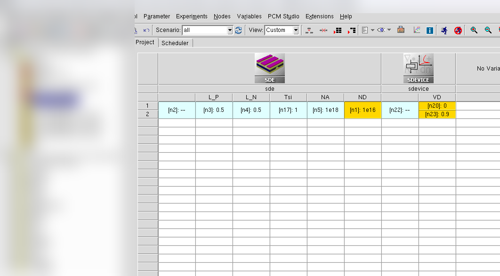
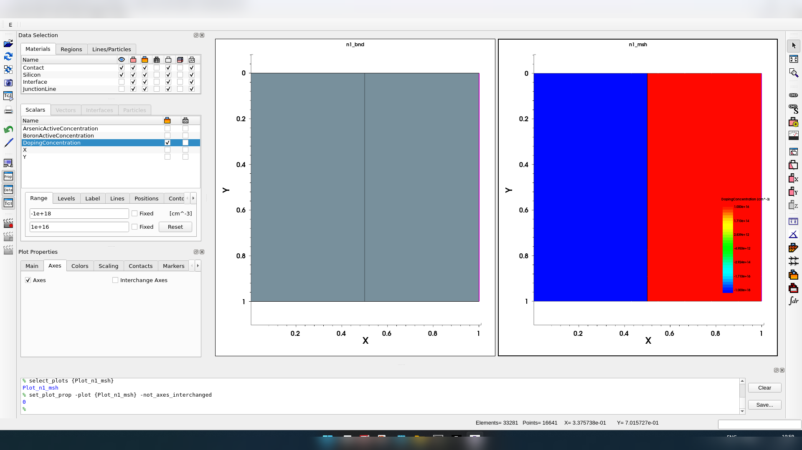
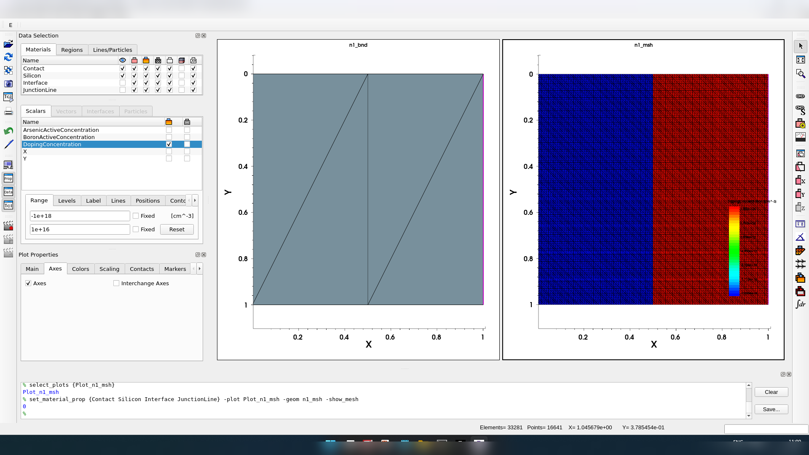
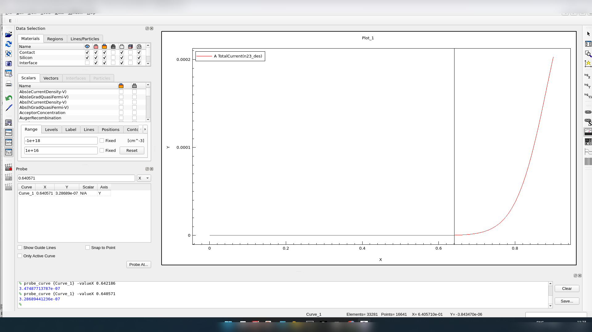
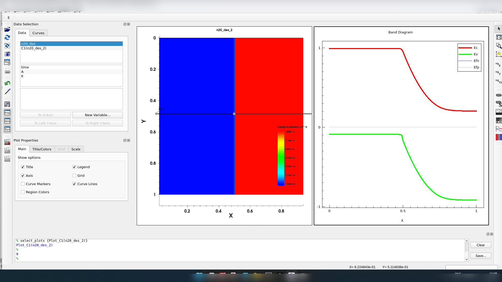

# PN Junction Diode — Forward I-V and Zero-Bias Band Diagram

TCAD device simulation exercise, part of a VLSI Devices & Technology course.

## Objective

Simulate a silicon PN junction diode with asymmetric doping, extract its forward-bias I-V
characteristic, and plot the zero-bias equilibrium energy-band diagram to identify the cut-in
voltage.

## Device Parameters

| Parameter | Value |
|---|---|
| P-region length, L_P | 0.5 µm |
| N-region length, L_N | 0.5 µm |
| Silicon thickness/height, T_si | 1 µm |
| P-region doping, N_A | 1×10¹⁸ cm⁻³ |
| N-region doping, N_D | 1×10¹⁶ cm⁻³ |
| Forward voltage sweep | 0 to 0.9 V |

## Structure

The device was built with the specified P/N region lengths and silicon thickness, doping was
assigned to each region, and the structure was meshed before simulation.

## Results

**Forward I-V characteristic** — total current vs. applied voltage:

The current stays very small through the low-voltage region and rises sharply near the knee.
Probe readouts on the curve fall around V ≈ 0.64 V, at a current on the order of 10⁻⁷ A,
placing the observed turn-on near **0.64 V**. No dedicated threshold marker was available in
the simulator, so this is a visual extraction from the plot rather than a precision-fit value.

**Zero-bias energy-band diagram** along the device:

The plot shows the expected bending of the conduction (E_C) and valence (E_V) band edges near
the junction, with the equilibrium Fermi level remaining flat across the device — consistent
with thermal equilibrium at zero applied bias.

## Discussion

With N_A = 10¹⁸ cm⁻³ and N_D = 10¹⁶ cm⁻³, the doping is intentionally asymmetric, so the
depletion region extends much further into the lightly-doped N-side than the P-side. The
forward I-V curve is flat at low voltage and becomes strongly nonlinear once the applied bias
approaches the built-in potential, and the band diagram independently confirms the expected
band bending at zero bias.

## Conclusion

The PN junction diode was simulated with the specified geometry and doping. The forward I-V
curve and zero-bias band diagram both behave as expected for an asymmetric silicon junction,
with an observed cut-in voltage of approximately **0.64 V**.
