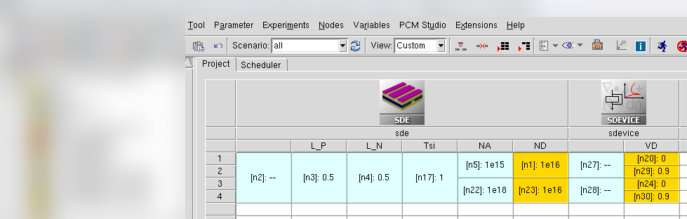
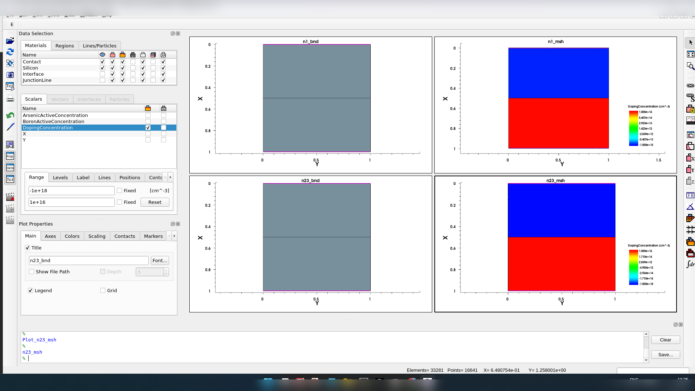
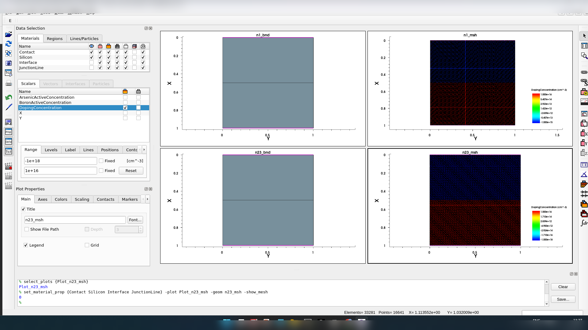
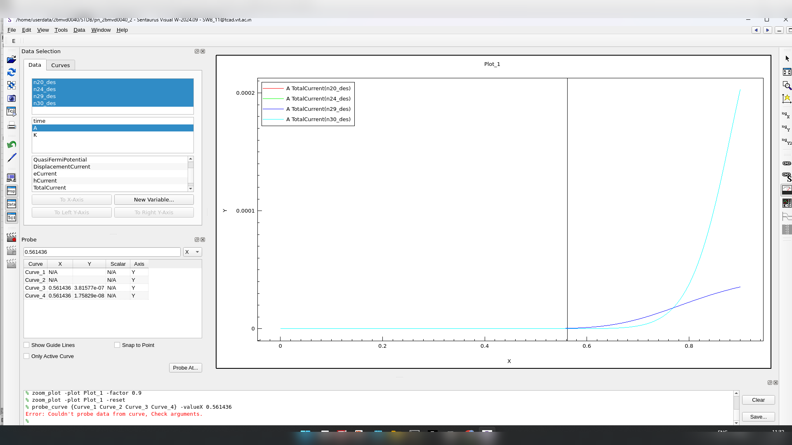
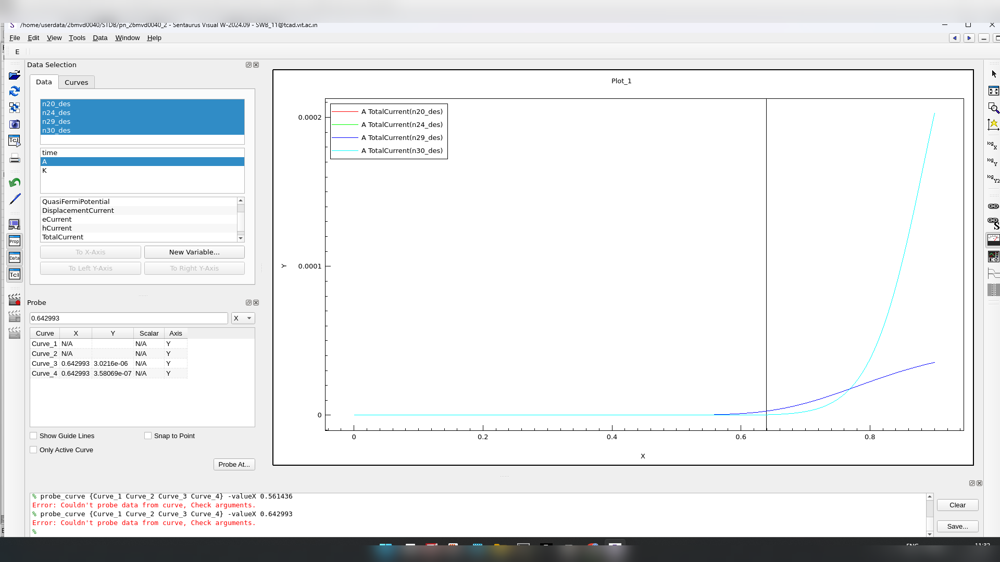
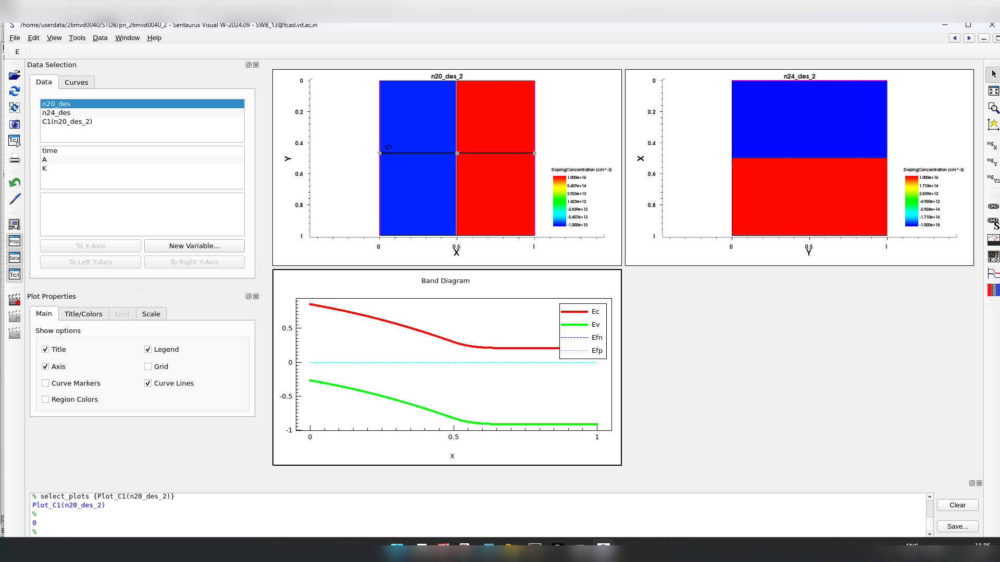
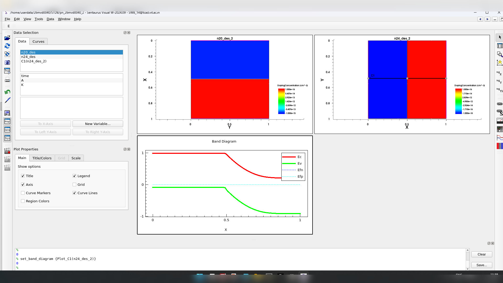

# PN Junction Diode — Effect of P-Side Doping on Forward I-V and Band Diagram

TCAD device simulation exercise, part of a VLSI Devices & Technology course.

## Objective

Simulate two silicon PN junctions that share the same N-side doping and geometry but differ in
P-side doping concentration, then compare their forward I-V characteristics and zero-bias
energy-band diagrams.

## Device Parameters

| Parameter | Value |
|---|---|
| P-region length, L_P | 0.5 µm |
| N-region length, L_N | 0.5 µm |
| Silicon thickness/height, T_si | 1 µm |
| N-region doping, N_D (fixed) | 1×10¹⁶ cm⁻³ |
| Case I — P-region doping, N_A | 1×10¹⁵ cm⁻³ |
| Case II — P-region doping, N_A | 1×10¹⁸ cm⁻³ |
| Forward voltage sweep | 0 to 0.9 V |

## Structure

Both cases share the same region lengths and silicon thickness; only the P-side doping differs
between Case I and Case II.

## Results

**Forward I-V characteristics**, both cases overlaid:

Reading the knee region of each trace gives an approximate cut-in voltage of about **0.75 V**
for Case I (N_A = 10¹⁵ cm⁻³) and about **0.65 V** for Case II (N_A = 10¹⁸ cm⁻³). These are
visual extractions from the plots — the simulator screenshots don't carry a dedicated cut-in
marker.

**Zero-bias energy-band diagrams:**

## Discussion

With the N-side fixed at N_D = 10¹⁶ cm⁻³, increasing the P-side doping from 10¹⁵ to 10¹⁸ cm⁻³
shifts the diode into strong forward conduction at a lower applied voltage — visible directly
in the I-V comparison. The two band diagrams also differ, reflecting a change in the
equilibrium built-in potential and depletion-region band bending as the doping asymmetry
changes.

## Conclusion

Both requested doping combinations were simulated and compared. Increasing P-side doping while
holding the N-side fixed lowers the observed forward turn-on voltage — approximately 0.75 V for
the lighter P-side doping (Case I) versus 0.65 V for the heavier P-side doping (Case II) — and
correspondingly changes the zero-bias band profile.
