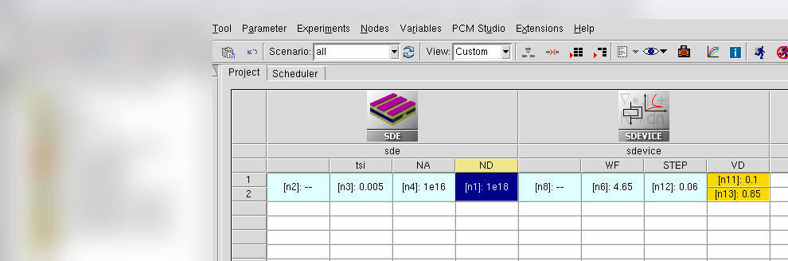
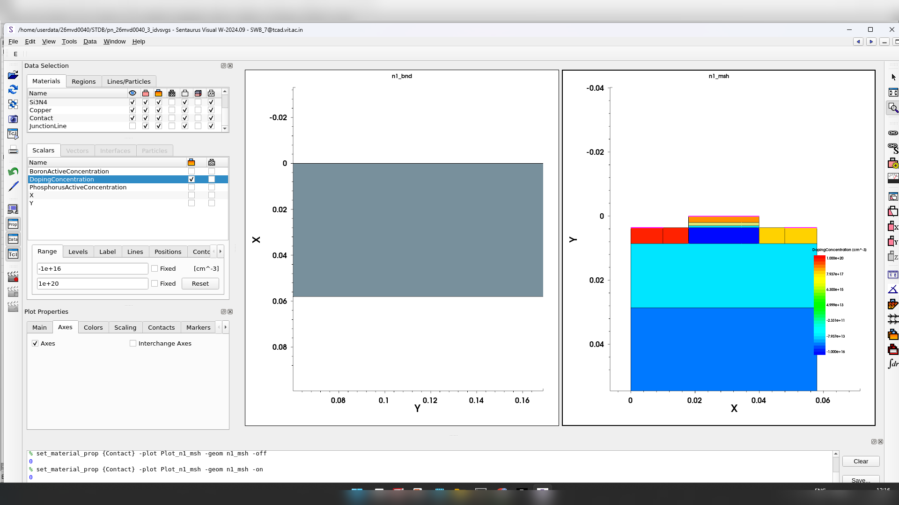
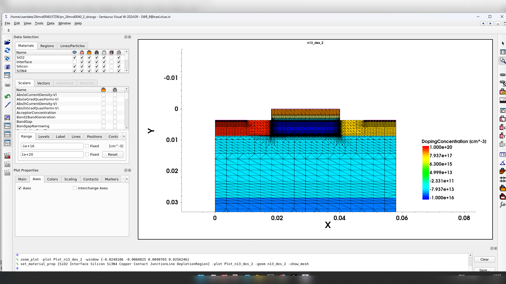
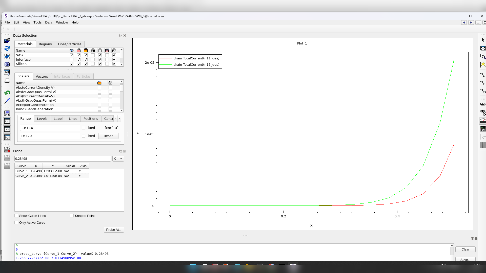
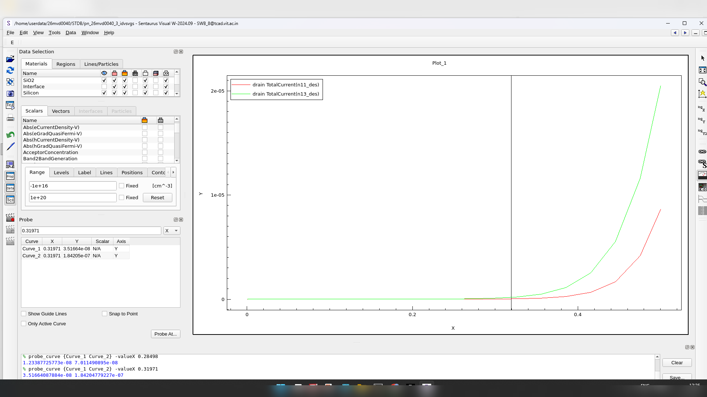
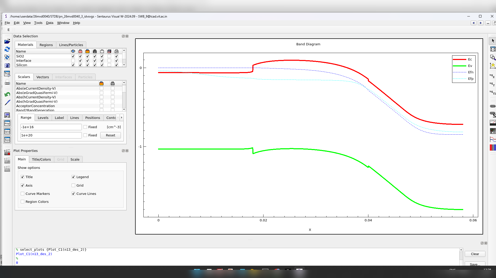
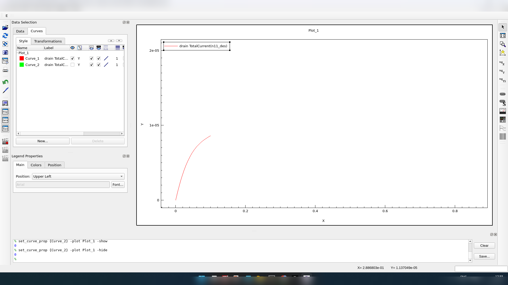
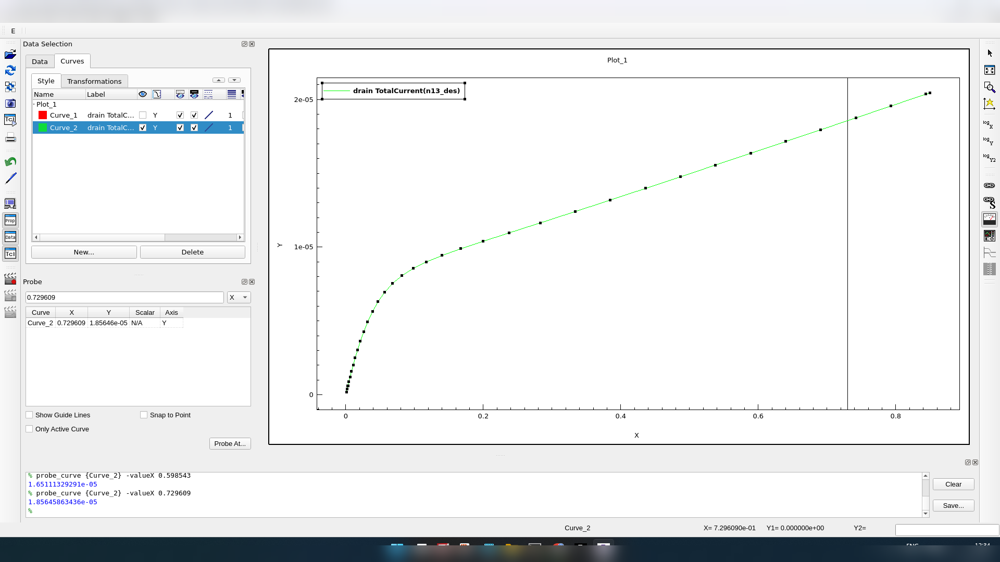
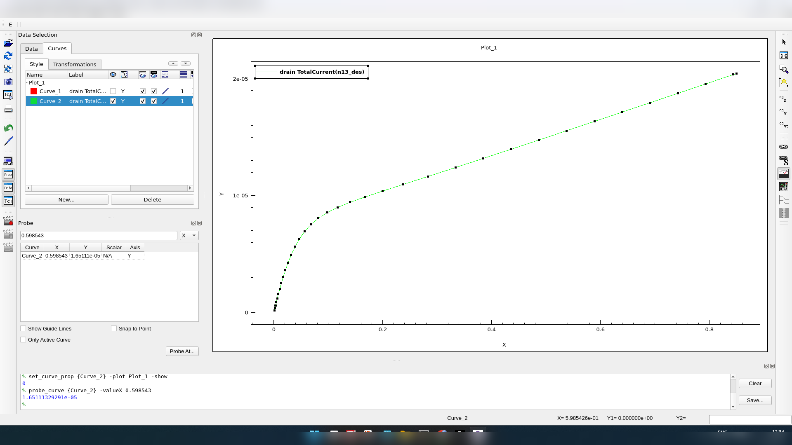

# 2D Planar N-MOSFET — DC Transfer/Output Characteristics and Channel-Length Modulation

TCAD device simulation exercise, part of a VLSI Devices & Technology course.

## Objective

Simulate a conventional 2D planar N-MOSFET, obtain its DC transfer and output characteristics,
examine threshold-voltage behavior at two drain biases, plot the channel energy-band diagram,
and extract the channel-length modulation parameter λ from the output curve.

## Device Parameters

| Parameter | Value |
|---|---|
| Silicon thickness, t_si | 0.005 µm (workbench value) |
| P-region/background doping, N_A | 1×10¹⁶ cm⁻³ |
| N-region/contact doping, N_D | 1×10¹⁸ cm⁻³ |
| Gate work function, WF | 4.65 eV |
| Sweep step | 0.06 V |
| Drain biases for transfer characteristics | 0.1 V and 0.85 V |



## Structure




## Results

**Transfer characteristics** (I_DS–V_GS) at the two drain-bias conditions:




Both traces (V_DS = 0.1 V and V_DS = 0.85 V) are visible in the simulator output. No dedicated
threshold-voltage marker was available, so the turn-on region was read visually; probe
positions bracket roughly 0.285–0.320 V. This is treated as a qualitative demonstration of
threshold roll-off with drain bias rather than a high-precision extracted value.

**Channel energy-band diagram** at the chosen bias point:



**Output characteristics** (I_DS–V_DS):





Two explicit points were read from the saturation region of the output curve:

- (V_DS1, I_D1) = (0.598543 V, 16.5113 µA)
- (V_DS2, I_D2) = (0.729609 V, 18.5646 µA)

Using the two-point estimate:

```
λ ≈ (I_D2 − I_D1) / [I_D1 · (V_DS2 − V_DS1)]
  ≈ (18.5646 − 16.5113) / [16.5113 × (0.729609 − 0.598543)]
  ≈ 0.95 V⁻¹
```

## Discussion

The transfer curves show a modest shift in turn-on voltage between the two drain biases,
consistent with drain-induced threshold modulation — though since no dedicated threshold
extraction marker was available, the roll-off should be read as qualitative rather than a
precise number. The positive λ ≈ 0.95 V⁻¹ indicates a clearly non-flat saturation region in the
output curve, i.e., channel-length modulation is clearly present in this device/bias
combination.

## Conclusion

The conventional 2D planar N-MOSFET was simulated across the requested drain-bias conditions.
The extracted channel-length modulation parameter from the two saturation-region points is
approximately **0.95 V⁻¹**. Threshold-voltage roll-off with drain bias is visible qualitatively
in the transfer curves, though a precise numeric threshold could not be extracted without a
dedicated marker in the simulator output.
