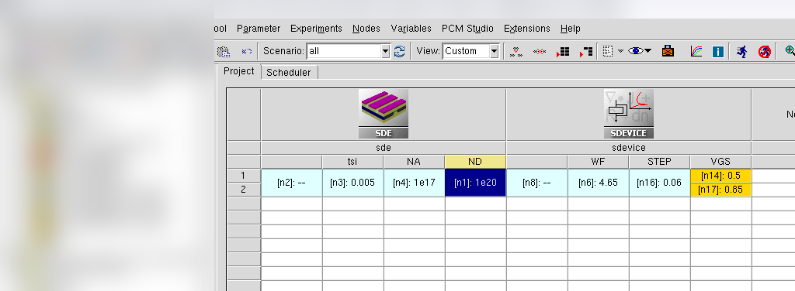
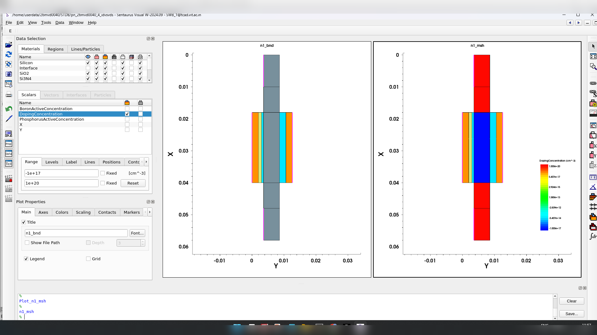
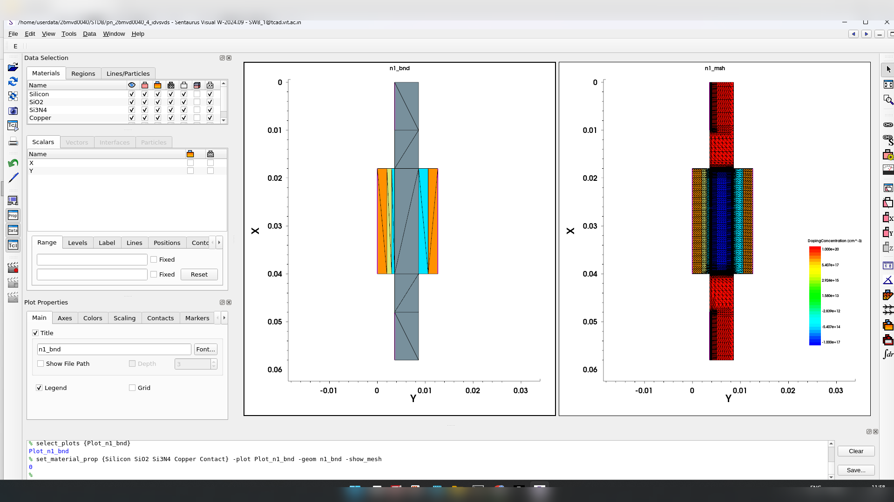
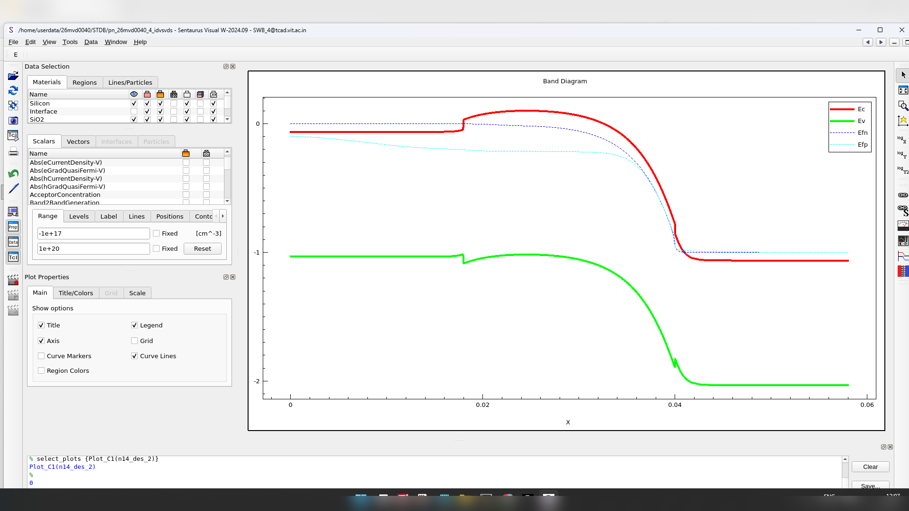
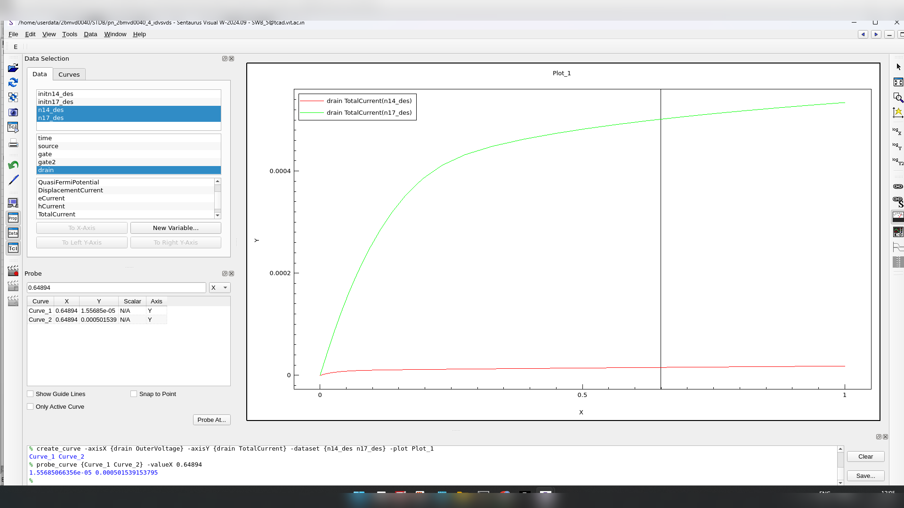
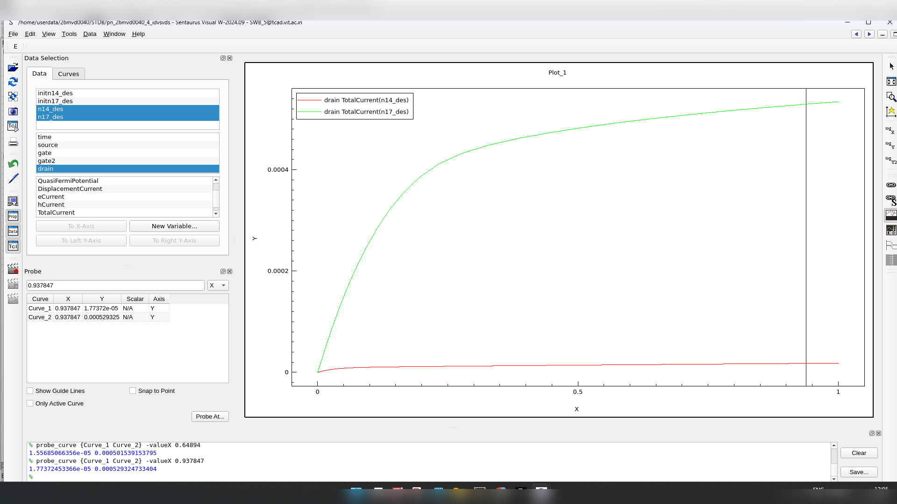
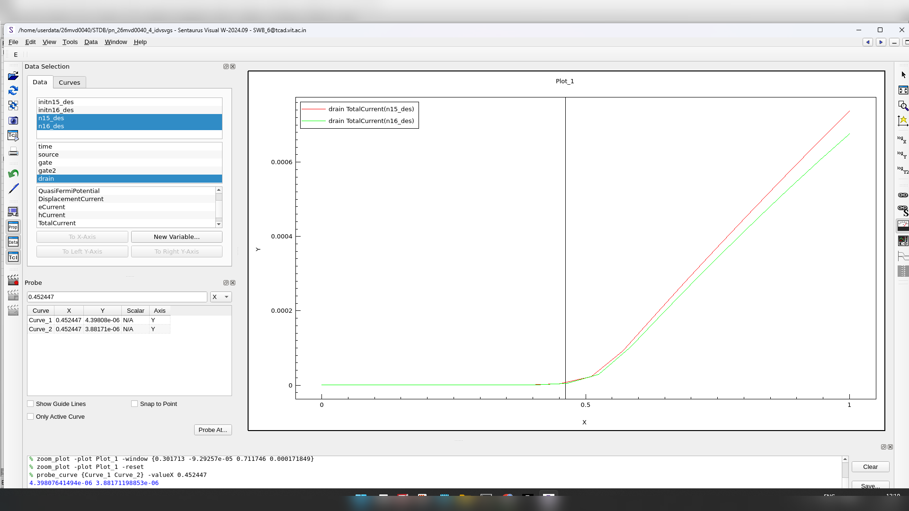
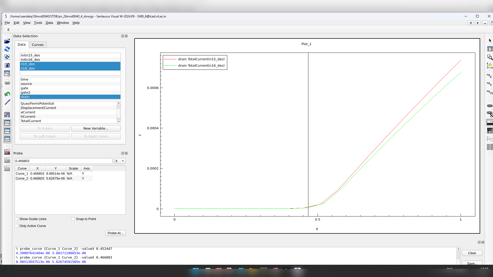

# 2D Double-Gate Planar N-MOSFET — Characteristics vs. Conventional Planar Device

TCAD device simulation exercise, part of a VLSI Devices & Technology course.

## Objective

Simulate a 2D double-gate planar N-MOSFET with the same gate bias applied to both top and
bottom gates, obtain its DC characteristics, extract the channel-length modulation parameter λ,
and compare the results against the conventional single-gate 2D planar N-MOSFET simulated
previously ([Assessment 3](03-nmos-2d-planar-characteristics.md)).

The gate stack uses two dielectrics on the top gate (mirroring the conventional device) and a
single dielectric on the bottom gate, with the same V_GS applied to both electrodes.

## Device Parameters

| Parameter | Value |
|---|---|
| Silicon thickness, t_si | 0.005 µm (workbench value) |
| P-region/background doping, N_A | 1×10¹⁷ cm⁻³ |
| N-region/contact doping, N_D | 1×10²⁰ cm⁻³ |
| Gate work function, WF | 4.65 eV |
| Sweep step | 0.06 V |
| Common gate biases | 0.5 V and 0.85 V |



## Structure




## Results

**Channel energy-band diagram** at the chosen bias:



**Output characteristics** (I_DS–V_DS), high-current view:




Two explicit saturation-region points were read from the high-current output curve:

- (0.64894 V, 0.501539 mA)
- (0.937847 V, 0.529325 mA)

```
λ ≈ (0.529325 − 0.501539) / [0.501539 × (0.937847 − 0.64894)]
  ≈ 0.192 V⁻¹
```

**Lower-current output views**, second gate-bias condition:




A dedicated fixed-V_DS transfer characteristic (I_DS–V_GS) with an explicit threshold marker
was not available for this run, so a numeric threshold-voltage pair for the 0.1 V / 0.85 V
comparison requested by the assignment could not be extracted without inventing data. That
limitation is recorded here rather than substituting an estimate.

## Discussion

The extracted λ ≈ 0.192 V⁻¹ for the double-gate device is noticeably smaller than the
λ ≈ 0.95 V⁻¹ obtained for the conventional single-gate 2D device in Assessment 3 — i.e., a
flatter saturation-region response in this run. This is a comparison between these two specific
simulation runs rather than a general dimensionality claim, since the two devices' parameter
sets (doping, geometry) are not identical.

The structure and band-diagram figures confirm the intended double-gate construction with
matched gate bias on both electrodes. Because the fixed-V_DS transfer screenshot needed for a
numerical threshold-roll-off comparison is missing, that part of the comparison with Assessment
3 could not be completed quantitatively.

## Conclusion

The 2D double-gate planar N-MOSFET was simulated with the required geometry and bias setup. The
extracted channel-length modulation parameter is approximately **0.192 V⁻¹**, flatter than the
conventional single-gate device from Assessment 3. The transfer/threshold-roll-off comparison
could not be completed numerically due to a missing fixed-drain-bias transfer plot in the
available data.
