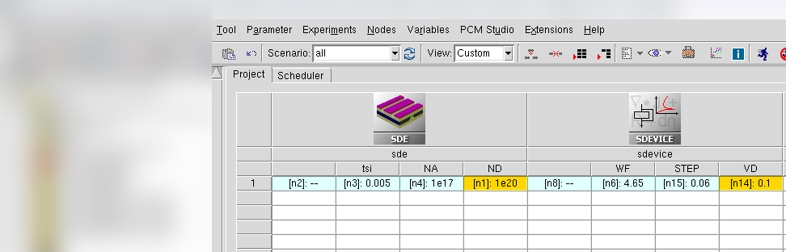
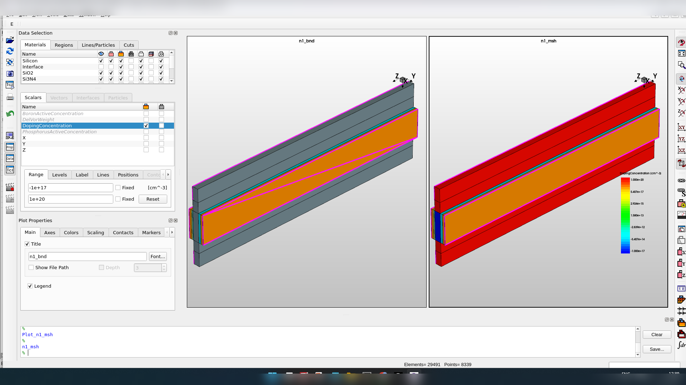
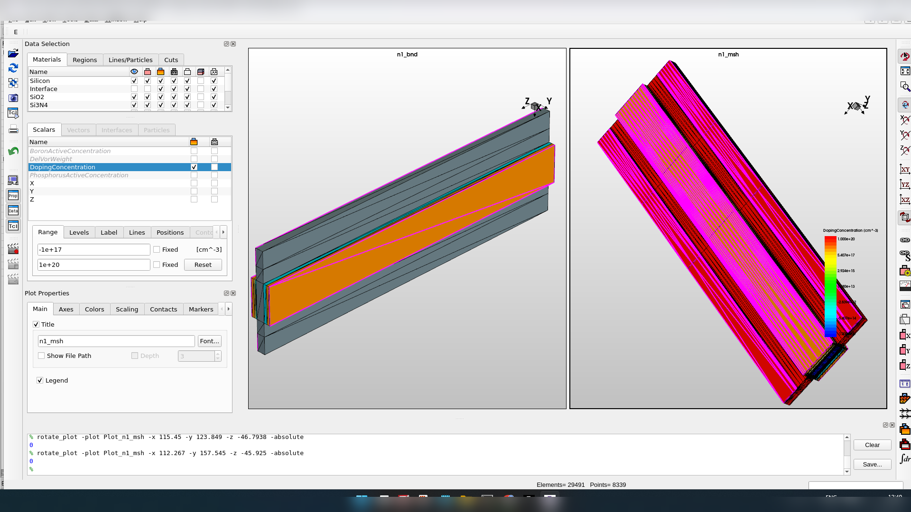
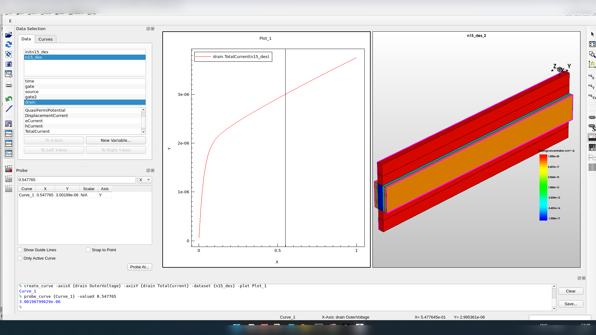
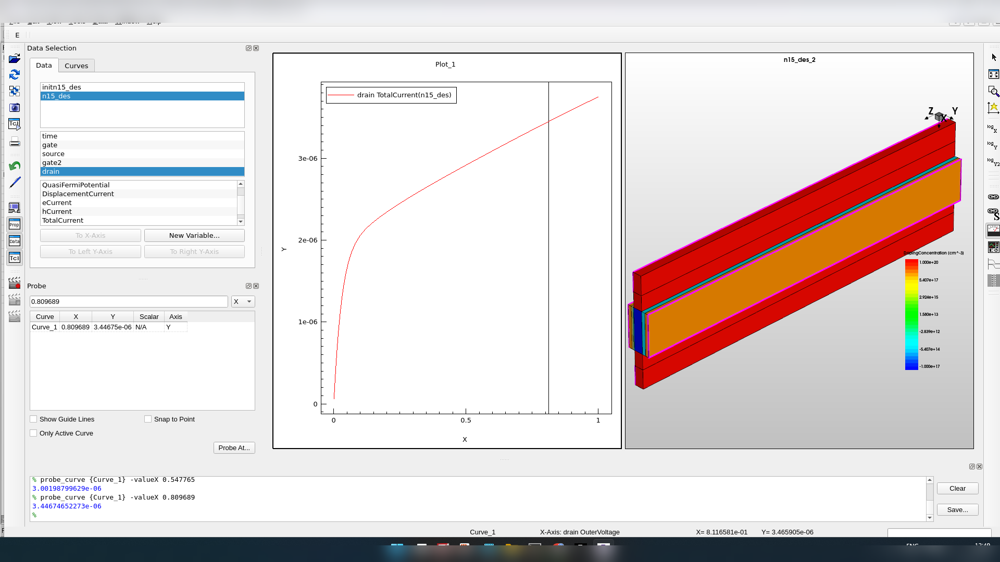

# 3D Double-Gate Planar N-MOSFET — Structure, Characteristics, and Comparison with 2D

TCAD device simulation exercise, part of a VLSI Devices & Technology course.

## Objective

Extend the double-gate planar N-MOSFET from [Assessment 4](04-nmos-double-gate-2d.md) into a
3D structure by adding a finite device width (the third, z-axis, dimension), then obtain the
transfer and output characteristics and compare against the 2D double-gate result.

## Device Parameters

| Parameter | Value |
|---|---|
| Silicon thickness, t_si | 0.005 µm (workbench value) |
| P-region/background doping, N_A | 1×10¹⁷ cm⁻³ |
| N-region/contact doping, N_D | 1×10²⁰ cm⁻³ |
| Gate work function, WF | 4.65 eV |
| Sweep step | 0.06 V |
| Drain bias for transfer characteristic | 0.1 V |
| Device width (z-axis) | 200 nm |



## Structure




## Results

**Transfer characteristic** (I_DS–V_GS) at V_DS = 0.1 V:


The turn-on region occurs around V_GS ≈ 0.33 V; probe readouts near 0.3280 V and 0.3349 V (both
in the low-nA current range) bracket the transition, giving an approximate threshold voltage of
**0.33 V**. As with the earlier assessments, this is a screenshot-based visual extraction rather
than a dedicated simulator threshold marker.

**Output characteristic** (I_DS–V_DS), two saturation-region probe points:




- (0.547765 V, 3.00198 µA)
- (0.809689 V, 3.44675 µA)

```
λ ≈ (3.44675 − 3.00198) / [3.00198 × (0.809689 − 0.547765)]
  ≈ 0.566 V⁻¹
```

## Discussion

The 3D double-gate device shows a clear gate-voltage turn-on near 0.33 V at the specified
0.1 V drain bias. The positive λ ≈ 0.566 V⁻¹ indicates a noticeable rise in drain current
through the saturation region of this run's output data.

Relative to the 2D double-gate result from Assessment 4 (λ ≈ 0.192 V⁻¹), this 3D run gives a
larger extracted λ. Because the two assignments use separate simulations with potentially
different numerical and geometric details beyond just dimensionality, this comparison is
specific to these two submitted datasets rather than a general statement about 2D vs. 3D
double-gate behavior.

## Conclusion

The 3D double-gate planar N-MOSFET was constructed with a finite 200 nm width and simulated.
The transfer curve gives an approximate threshold voltage of **0.33 V** at V_DS = 0.1 V, and
the two saturation-region output points give **λ ≈ 0.566 V⁻¹**. The comparison with the 2D
double-gate device (Assessment 4) is based on these specific simulation runs.
